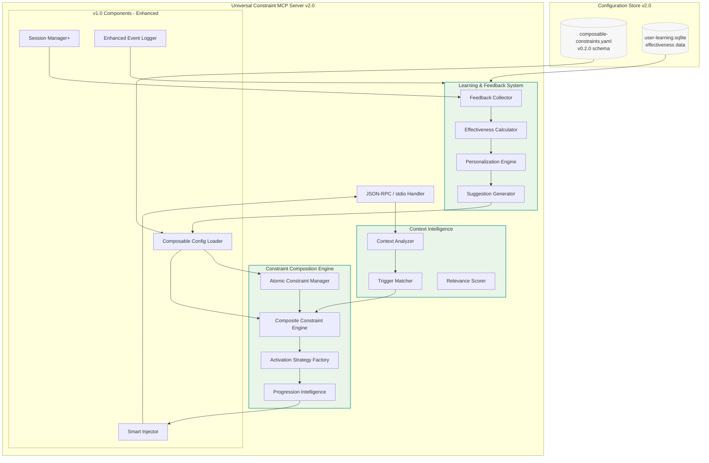
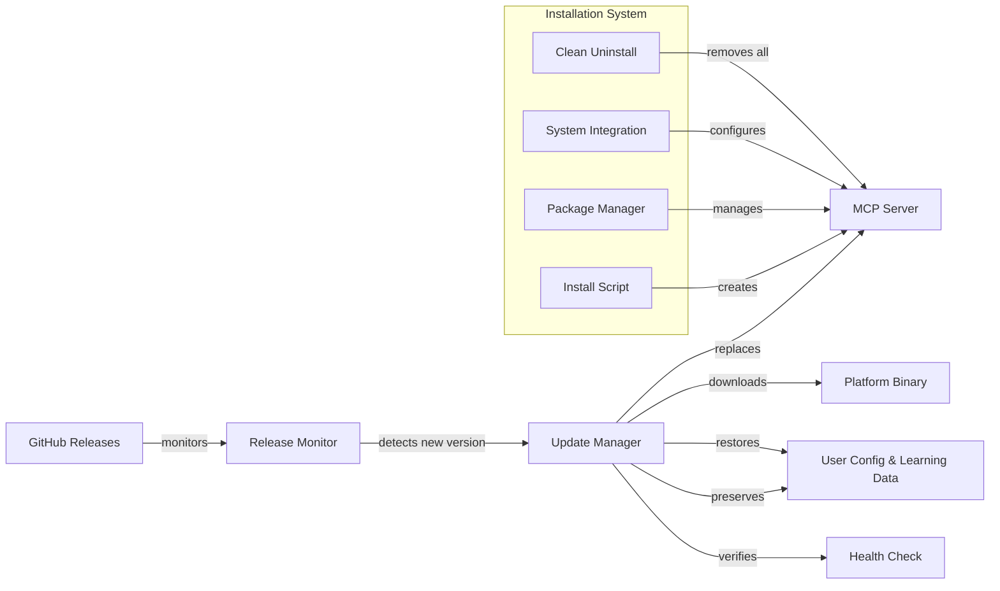
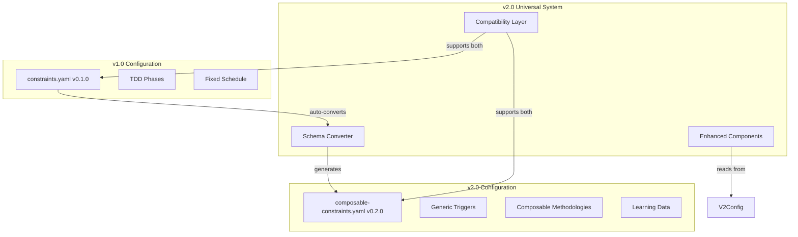

# Constraint Enforcement MCP Server — ARCHITECTURE.md v2.0

> **Vision:** Universal, composable, learning-enabled constraint reminder system for any development methodology with professional distribution and auto-update capabilities.

---

## 1) Design Principles Evolution

### v1.0 Foundation (Achieved) ✅
- **Deterministic, low-latency**: <50ms p95 per tool call proven with 144 tests
- **Simple first**: TDD-specific YAML constraints with fixed cadence
- **Bounded contexts**: Catalog, Enforcement, Observation implemented
- **Reproducible**: Same inputs → same outputs validated
- **Hexagonal**: Domain-centered architecture with port/adapter boundaries

### v2.0 Evolution (Target)
- **Generic & Composable**: Any methodology (TDD, BDD, DDD, Clean Architecture, Outside-In)
- **Learning-Enabled**: Continuous improvement through user feedback and effectiveness tracking
- **Context-Aware**: Intelligent trigger matching beyond simple cadence
- **Professional Distribution**: GitHub-based auto-updates with clean installation
- **Performance Maintained**: <50ms p95 latency despite increased complexity

---

## 2) System Context v2.0 (C4‑1)
```mermaid
flowchart TB
  Dev((Developer)) --- IDE[Claude Code / IDE]

  IDE <-->|JSON-RPC (MCP stdio)| MCP[[Universal Constraint MCP Server v2.0]]

  subgraph Tools[Developer Tools]
    FS[Filesystem]
    GIT[Git]
    TEST[Test Runner]
    BUILD[Build System]
  end

  IDE -->|tool calls with context| FS
  IDE -->|tool calls| GIT
  IDE -->|tool calls| TEST
  IDE -->|tool calls| BUILD

  MCP -->|reads & learns from| CFG[(composable-constraints.yaml\nuser-learning.db)]
  MCP -->|triggers & injects| IDE
  MCP --> LOGS[(structured logs\nNDJSON with analytics)]

  subgraph Distribution[Professional Distribution]
    GITHUB[GitHub Releases]
    INSTALLER[Auto-Update Service]
    PACKAGE[Package Manager]
  end

  GITHUB -->|monitors & downloads| INSTALLER
  INSTALLER -->|updates| MCP
  PACKAGE -->|manages| MCP

  subgraph Learning[Learning System v2.0]
    FEEDBACK[Feedback Collection]
    ANALYTICS[Effectiveness Analysis]
    SUGGESTIONS[Improvement Suggestions]
  end

  FEEDBACK -->|tracks behavior| MCP
  MCP -->|provides data| ANALYTICS
  ANALYTICS -->|generates| SUGGESTIONS
  SUGGESTIONS -->|optimizes| CFG

  classDef store fill:#f7f7f7,stroke:#bbb,stroke-width:1px,color:#333
  classDef v2 fill:#e8f5e8,stroke:#4a9,stroke-width:2px,color:#333
  class CFG,LOGS store
  class MCP,Learning,Distribution v2
```

**Key v2.0 Additions:**
- **Universal methodology support** replacing TDD-specific implementation
- **Learning system** with user feedback and effectiveness optimization
- **Professional distribution** with auto-updates and package management
- **Context-aware triggers** replacing simple phase-based activation

---

## 3) Composable Constraint Architecture (C4‑2)



**Request Lifecycle v2.0:**
1. `RPC` receives tool call with context
2. `CTX` analyzes user input and file context
3. `TRIGGER` matches against constraint triggers (keywords, contexts, patterns)
4. `COMPOSITE` evaluates atomic and composite constraint activation
5. `ACTIVATION` creates appropriate strategy (sequence, hierarchical, progressive)
6. `PROGRESSION` determines next step in methodology workflow
7. `INJ` injects contextually relevant reminders
8. `FEEDBACK` tracks user behavior and effectiveness
9. `LOG` emits enhanced structured events

---

## 4) Composable Constraint Model v2.0

### 4.1 Constraint Composition Hierarchy
```
Outside-In Development
├── Acceptance Testing
│   ├── Write failing acceptance test
│   └── Define business scenarios
├── BDD (Behavior-Driven Development) 
│   ├── Given-When-Then structure
│   └── Ubiquitous language
└── TDD (Test-Driven Development)
    ├── Write failing test first (RED)
    ├── Write simplest code to pass (GREEN)
    └── Refactor
        ├── Level 1: Readability (comments, naming, magic numbers)
        ├── Level 2: Complexity (extract methods, remove duplication)
        ├── Level 3: Responsibilities (class size, coupling)
        ├── Level 4: Abstractions (parameter objects, value objects)
        ├── Level 5: Patterns (strategy, state, command)
        └── Level 6: SOLID++ (architectural principles)
```

### 4.2 Enhanced Data Model (TypeScript-like)
```ts
// v2.0 Constraint Types
type ConstraintId = string;
type ConstraintType = 'atomic' | 'composite';
type CompositionType = 'sequence' | 'hierarchical' | 'progressive' | 'layered' | 'parallel';

interface Trigger {
  keywords: string[];
  contexts: string[];
  file_patterns?: string[];
  anti_keywords?: string[];
  confidence_threshold: number;
}

interface AtomicConstraint {
  id: ConstraintId;
  type: 'atomic';
  title: string;
  priority: number;
  effectiveness_score?: number;  // Learned metric
  feedback_count?: number;
  triggers: Trigger;
  reminders: ReminderWithEffectiveness[];
  learning?: LearningMetrics;
}

interface CompositeConstraint {
  id: ConstraintId;
  type: 'composite';
  title: string;
  priority: number;
  composition: {
    type: CompositionType;
    sequence?: ConstraintId[];
    hierarchy?: Record<string, ConstraintId[]>;
    levels?: ConstraintId[];
    layers?: Record<string, LayerDefinition>;
    relationships?: Relationship[];
  };
  triggers: Trigger;
  learning?: CompositeLearningMetrics;
}

interface ReminderWithEffectiveness {
  text: string;
  effectiveness: number;
}

interface LearningMetrics {
  positive_feedback: number;
  negative_feedback: number;
  suggestions: string[];
}

interface CompositeLearningMetrics {
  sequence_completion_rate?: number;
  common_dropout_point?: string;
  effectiveness_by_phase?: Record<string, number>;
  coordination_effectiveness?: number;
}

// Learning System Types
interface UserFeedback {
  constraint_id: string;
  rating: number; // 1-5
  comment?: string;
  context: string;
  timestamp: Date;
}

interface EffectivenessMetrics {
  overall_score: number;
  component_scores: Record<string, number>;
  user_feedback: string;
  improvement_suggestions: string[];
}
```

### 4.3 Enhanced Configuration Schema
```yaml
version: "0.2.0"
metadata:
  user_id: "anonymous_hash"
  install_date: "2025-01-20"
  learning_enabled: true

# Atomic constraints (building blocks)
atomic_constraints:
  - id: testing.failing-test-first
    title: "Write a failing test first"
    priority: 0.92
    effectiveness_score: 0.85  # Learned metric
    triggers:
      keywords: [testing, "new feature", implementation, "test first", TDD]
      contexts: [feature_start, method_creation]
      file_patterns: ["*.test.*", "*Test.cs", "*_test.py"]
      confidence_threshold: 0.7
    reminders:
      - text: "Start with a failing test (RED) before implementation"
        effectiveness: 0.89
      - text: "Let the test drive the API design and behavior"
        effectiveness: 0.78
    learning:
      positive_feedback: 18
      negative_feedback: 5
      suggestions: ["Make reminders more specific to context"]

# Composite constraints (methodologies)
composite_constraints:
  - id: methodology.outside-in
    title: "Outside-In Development"
    priority: 0.95
    composition:
      type: hierarchical
      coordination: "acceptance_test_drives_inner_cycles"
      hierarchy:
        level_0: [acceptance.failing-first]
        level_1: [methodology.bdd]
        level_2: [methodology.tdd]
    triggers:
      keywords: ["outside in", "acceptance driven", "double loop"]
      contexts: [feature_start, epic_development]
    learning:
      coordination_effectiveness: 0.82
      level_adherence:
        acceptance_level: 0.89
        bdd_level: 0.76
        tdd_level: 0.84

  - id: refactoring.cycle
    title: "Refactoring Cycle"
    priority: 0.80
    composition:
      type: progressive_levels
      levels: [
        refactoring.level1.readability,
        refactoring.level2.complexity,
        refactoring.level3.responsibilities,
        refactoring.level4.abstractions,
        refactoring.level5.patterns,
        refactoring.level6.solid
      ]
      progression_strategy: "level_by_level"
      allow_level_skipping: false
    learning:
      average_completion_level: 2.3
      level_completion_rates:
        level_1: 0.92
        level_2: 0.81
        level_3: 0.67
        level_4: 0.43
        level_5: 0.28
        level_6: 0.19
      barrier_analysis:
        major_barriers: [level_3, level_5]

# Learning and feedback system
learning:
  effectiveness_calculation:
    formula: "0.4 * direct_feedback + 0.3 * positive_behavior + 0.3 * context_success"
    minimum_sample_size: 10
    confidence_intervals: true

feedback_system:
  collection_methods:
    post_session_prompts:
      frequency: "every_5_sessions"
    implicit_feedback:
      positive_signals:
        - "user_follows_reminder_within_5_minutes"
        - "test_written_after_tdd_reminder"
        - "refactoring_applied_after_suggestion"
      negative_signals:
        - "reminder_dismissed_immediately"
        - "opposite_action_taken"
        - "session_productivity_drops_after_reminder"
```

---

## 5) Bounded Contexts v2.0 & Hexagonal Ports

### Enhanced Bounded Contexts
- **Constraint Catalog** (composable authoring, versioning, validation)
  - Ports: `IAtomicConstraintReader`, `ICompositeConstraintReader`, `IConstraintValidator`, `IConfigurationConverter`
- **Context Intelligence** (trigger matching, relevance scoring)
  - Ports: `ITriggerMatcher`, `IContextAnalyzer`, `IRelevanceScorer`
- **Composition Engine** (methodology orchestration, activation strategies)
  - Ports: `ICompositionEngine`, `IActivationStrategyFactory`, `IProgressionTracker`
- **Learning & Feedback** (effectiveness tracking, personalization)
  - Ports: `IFeedbackCollector`, `IEffectivenessCalculator`, `IPersonalizationEngine`, `ISuggestionGenerator`
- **Professional Distribution** (auto-updates, package management)
  - Ports: `IAutoUpdateService`, `IPackageManager`, `ISystemIntegration`
- **Enhanced Observation** (analytics, user behavior tracking)
  - Ports: `IEnhancedEventLogger`, `IAnalyticsCollector`, `IBehaviorTracker`

### New Adapters v2.0
- **GitHub Release Adapter**: Monitors releases and downloads updates
- **SQLite Learning Adapter**: Stores user feedback and effectiveness data
- **File System Watcher**: Monitors configuration changes for hot-reload
- **Context Analysis Adapter**: Analyzes file types, code patterns, user behavior
- **Cross-Platform Installer**: Handles installation, updates, and uninstallation

---

## 6) Enforcement Logic v2.0

### Intelligent Trigger Matching
- **Context Analysis**: File type detection, user input analysis, session state
- **Keyword Matching**: Weighted keyword scoring with confidence thresholds
- **Anti-Pattern Exclusions**: Prevent inappropriate triggers (e.g., no TDD during hotfixes)
- **Relevance Scoring**: Contextual relevance calculation >80% threshold

### Composable Activation Strategies
- **Sequential Activation**: TDD phases (RED → GREEN → REFACTOR)
- **Hierarchical Activation**: Outside-In coordination (Acceptance → BDD → TDD)
- **Progressive Activation**: Refactoring levels (Level 1 → 6 with barrier detection)
- **Layered Activation**: Clean Architecture (Domain → Application → Infrastructure → Presentation)

### Learning-Enhanced Selection
- **Effectiveness-Weighted Priority**: Use learned effectiveness scores
- **User Behavior Adaptation**: Personalize based on user patterns
- **Barrier Point Detection**: Identify and provide extra support at common drop-offs
- **Success Pattern Recognition**: Reinforce patterns that lead to positive outcomes

---

## 7) Performance Budgets v2.0

### Maintained Performance (Despite Complexity)
- **Request handler p95**: ≤50ms maintained (enhanced with caching and optimization)
- **Memory ceiling**: ≤100MB resident (with learning data and composition engine)
- **Learning database**: <10MB local SQLite with automatic cleanup
- **Context analysis**: <5ms additional latency per request
- **Composition evaluation**: <10ms for complex methodologies

### Performance Optimization Strategies
- **Intelligent Caching**: Cache composition strategies and trigger matches
- **Lazy Loading**: Load complex compositions only when triggered
- **Background Learning**: Process feedback and effectiveness calculations asynchronously
- **Optimized Data Structures**: Use efficient algorithms for constraint matching and selection

---

## 8) Enhanced Observability v2.0

### Structured Events (NDJSON) - Enhanced
```json
{
  "timestamp": "2025-08-25T15:30:00Z",
  "event_type": "constraint_activation",
  "session_id": "abc-123",
  "interaction": 5,
  "trigger_analysis": {
    "user_input": "I need to implement a new feature for user authentication",
    "detected_contexts": ["feature_start", "authentication", "implementation"],
    "keyword_matches": ["implement", "feature", "authentication"],
    "confidence_score": 0.87
  },
  "activated_constraints": [
    {
      "constraint_id": "methodology.outside-in",
      "constraint_type": "composite",
      "activation_strategy": "hierarchical",
      "current_level": "level_0",
      "next_constraint": "acceptance.failing-first"
    }
  ],
  "learning_context": {
    "user_effectiveness_profile": "intermediate",
    "previous_success_rate": 0.78,
    "barrier_risk_factors": ["time_pressure"]
  },
  "performance": {
    "processing_time_ms": 23,
    "context_analysis_ms": 3,
    "composition_evaluation_ms": 8,
    "selection_time_ms": 4,
    "injection_time_ms": 2
  }
}
```

### Analytics and Learning Metrics
- **User Progression Tracking**: Methodology completion rates, level progression, barrier points
- **Constraint Effectiveness**: Success rates, user satisfaction, behavior change indicators
- **System Performance**: Latency trends, memory usage, accuracy metrics
- **Improvement Opportunities**: Data-driven suggestions for configuration optimization

---

## 9) Testing Strategy v2.0

### Enhanced Test Categories
- **E2E Tests**: MCP protocol compliance, complex methodology workflows
- **Composition Tests**: Atomic/composite constraint interactions, activation strategies
- **Learning Tests**: Feedback collection, effectiveness calculation, personalization
- **Integration Tests**: Auto-update system, configuration migration, cross-platform compatibility
- **Performance Tests**: Enhanced latency validation with composition complexity
- **Mutation Testing**: Learning algorithms, composition logic, trigger matching

### Test Coverage Requirements
- **Maintain v1.0 Suite**: All 144 existing tests pass
- **New Features**: ≥90% test coverage for all v2.0 components
- **Learning Algorithms**: 100% mutation testing coverage
- **Cross-Platform**: Validation on Linux/Windows/macOS
- **Performance**: <50ms p95 latency maintained under load

---

## 10) Professional Distribution Architecture

### GitHub-Based Auto-Update System


### Cross-Platform Package Management
- **One-Command Install**: `curl -sSL https://install.constraint-mcp.dev | bash`
- **Auto-Update**: Background monitoring every 30 minutes
- **Configuration Preservation**: Seamless config and learning data migration
- **Clean Uninstall**: Complete resource cleanup with user data options
- **Rollback Capability**: Automatic rollback if updates fail
- **System Integration**: PATH registration, service management, health monitoring

---

## 11) Migration Strategy v1.0 → v2.0

### Backward Compatibility Architecture


### Migration Process
1. **Automatic Detection**: System detects v1.0 configuration on startup
2. **Schema Conversion**: Converts v1.0 YAML to v2.0 format with mapping
3. **Feature Enhancement**: TDD phases → trigger-based activation
4. **Validation**: Ensures converted configuration maintains same behavior
5. **Gradual Migration**: Users can opt-in to v2.0 features incrementally
6. **Rollback Support**: Full rollback to v1.0 if migration issues occur

---

## 12) Security & Privacy (Enhanced Local-First)

### Data Protection v2.0
- **Local-Only Learning**: All effectiveness data stays on user machine
- **Anonymous Analytics**: User ID is hash, no PII collection
- **Secure Updates**: Cryptographically signed binaries from GitHub
- **Configuration Encryption**: Optional encryption for sensitive constraint data
- **Privacy Controls**: User can disable learning, delete data, or export for backup

### Security Enhancements
- **Update Verification**: SHA256 checksum validation for all downloads
- **Sandboxed Execution**: Run with minimal required permissions
- **Configuration Validation**: Prevent injection attacks through malformed YAML
- **Audit Logging**: Security events logged for compliance and debugging

---

## 13) Repository Layout v2.0 (Enhanced)
```
/ src
  / ConstraintMcpServer
    / Application
      / Composition              # Composition engine, activation strategies
      / Triggers                 # Context analysis, trigger matching
      / Learning                 # Feedback collection, effectiveness calculation
      / Progression              # User progression tracking, barrier detection
    / Domain
      / Constraints              # Atomic/composite constraint models
      / Context                  # Session, file, user context
      / Learning                 # Learning metrics, user feedback
      / Composition              # Composition types, relationships
    / Infrastructure
      / Mcp                      # Enhanced MCP stdio JSON-RPC server
      / Config                   # v2.0 schema reader, migration utilities
      / Logging                  # Enhanced analytics and behavior tracking
      / Distribution             # Auto-update, package management
      / Learning                 # SQLite learning data store
/ config
  composable-constraints.yaml     # v2.0 schema examples
  constraint-packs/               # Methodology-specific constraint packs
/ scripts
  install-constraint-mcp.sh       # One-command installation
  uninstall-constraint-mcp.sh     # Clean uninstallation
  migrate-config.sh               # v1.0 → v2.0 migration utility
/ tests
  ConstraintMcpServer.Tests       # Enhanced test suite (200+ tests)
  ConstraintMcpServer.Integration.Tests
  ConstraintMcpServer.Learning.Tests
  ConstraintMcpServer.Distribution.Tests
.github/workflows
  ci.yml                          # Enhanced CI/CD with v2.0 features
  release.yml                     # Automated release and distribution
/docs
  ARCHITECTURE.md (this)          # v2.0 architecture documentation
  USER_GUIDE.md                   # Installation and usage guide
  METHODOLOGY_GUIDE.md            # Creating constraint packs guide
  MIGRATION_GUIDE.md              # v1.0 → v2.0 migration guide
```

---

## 14) v2.0 Implementation Phases

### Phase A: Generic Trigger System (3-4 weeks)
- Replace TDD-specific phases with universal triggers
- Implement context analysis and keyword matching
- Create v1.0 → v2.0 configuration migration
- Maintain backward compatibility

### Phase B: Composable Architecture (4-5 weeks)
- Implement atomic/composite constraint model
- Build composition engine with multiple strategies
- Add progression intelligence and barrier detection
- Support complex methodology workflows

### Phase C: Learning & Feedback System (4-5 weeks)
- Implement feedback collection (explicit + implicit)
- Build effectiveness calculation and learning algorithms
- Add personalization and suggestion generation
- Create local SQLite learning data store

### Phase D: Professional Distribution (3-4 weeks)
- Implement GitHub-based auto-update system
- Create cross-platform installation/uninstallation
- Add package management and system integration
- Build health monitoring and diagnostics

**Total Estimated Timeline**: 14-18 weeks for complete v2.0 transformation

---

## 15) Success Criteria v2.0

### Technical Success
- [ ] **Performance Maintained**: <50ms p95 latency despite increased complexity
- [ ] **Universal Support**: Any methodology works (TDD, BDD, DDD, Clean Architecture, Outside-In)
- [ ] **Composable Workflows**: Complex methodologies compose correctly
- [ ] **Learning Effectiveness**: User satisfaction and constraint effectiveness improve over time

### User Experience Success
- [ ] **Professional Installation**: One-command install with auto-updates
- [ ] **Seamless Migration**: v1.0 users upgrade without configuration loss
- [ ] **Contextual Intelligence**: Constraints activate with >80% relevance
- [ ] **Intelligent Progression**: Users guided through complete methodology workflows

### Distribution Success
- [ ] **Cross-Platform**: Works on Linux, Windows, macOS
- [ ] **Clean Lifecycle**: Professional install, update, uninstall experience
- [ ] **Zero Configuration**: Works out-of-the-box with intelligent defaults
- [ ] **Community Ready**: Shareable constraint packs and methodology templates

---

**Summary v2.0**: This architecture evolves the deterministic v1.0 walking skeleton into a universal, composable, learning-enabled constraint system that maintains the core values of low latency and high effectiveness while adding sophisticated methodology support, intelligent context awareness, continuous learning, and professional distribution capabilities. The system transforms from a TDD-specific proof-of-concept into a production-ready platform for any development methodology.